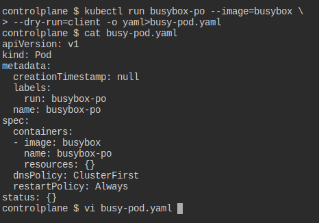
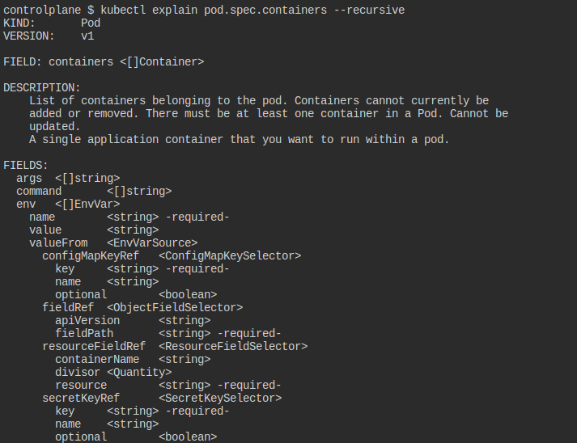
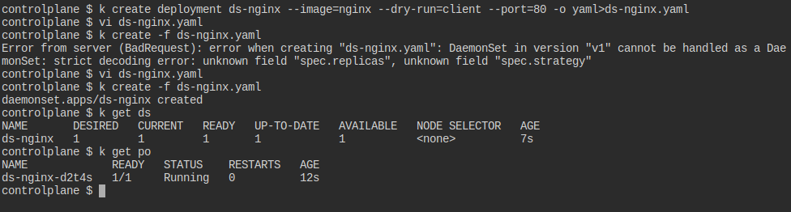
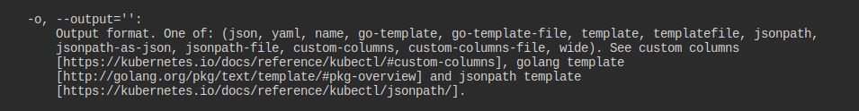
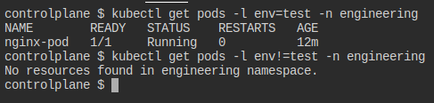

# Título de la Página

## Cluster Architecture, Installation & Configuration

| Topic | keywords |
|-----------|-----------|
| etcd | [etcd](https://kubernetes.io/search/?q=etcd) 🔍️ | 
| Create Secrets | 💻️ `kubectl create secret generic -h`| 
| Create a namespace with the specified name. | 💻️ `kubectl create namespace -h` | 
| create configmap from ... | 💻️ `kubectl create configmap -h` | 
| Co    ntenido 3.1 | Contenido 3.2 | 

## Workloads & Scheduling

| Topic | Tip |
|-----------|-----------|
| Create more complex pod| 📝 Create a simple Pod manifest and edit     If you need extra help  |
| Pods limits CPU/MEM | [limits](https://kubernetes.io/search/?q=limits) 🔍️|
| Rollback something | [undo](https://kubernetes.io/search/?q=undo) 🔍️  💻️ `kubectl rollout -h` examples|
| Create DaemonSet | 📝 Edit file, change Deployment to DaemonSet, and remove surplus fields.    to have the daemonset runnable on control plane search [Daemonset](https://kubernetes.io/search/?q=Daemonset) 🔍️|
| Contenido 3.1 | Contenido 3.2 |
| Contenido 3.1 | Contenido 3.2 |

## Others

| Topic | Tip |
|-----------|-----------|
| List Resources | 💻️ `kubectl get -h` help!      [custom-colum](https://kubernetes.io/search/?q=custom-colum) 🔍️  [jsonpath](https://kubernetes.io/search/?q=jsonpath) 🔍️|
| Filter by label |  |
| Contenido 3.1 | Contenido 3.2 |

extractions custom-columns